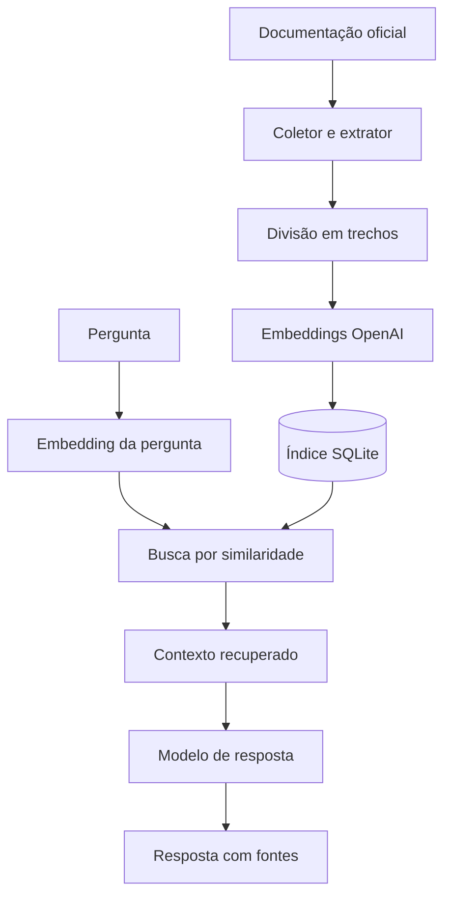

# Datadog Docs RAG

Aplicação web baseada em **Retrieval-Augmented Generation (RAG)** para pesquisar a documentação oficial do Datadog e gerar respostas técnicas em português com referências para as páginas utilizadas.

O projeto coleta páginas autorizadas de `docs.datadoghq.com`, divide o conteúdo em trechos, gera embeddings pela OpenAI e mantém um índice vetorial local em SQLite. Durante uma consulta, os trechos semanticamente mais relevantes são enviados ao modelo, que responde exclusivamente com base no contexto recuperado.

> **Status:** MVP funcional para execução local, com indexação incremental, interface web, API REST e rastreabilidade das fontes.

## Objetivos

- Reduzir o tempo necessário para localizar informações na documentação do Datadog.
- Centralizar consultas sobre Agent, integrações, logs, APM, monitores, dashboards e API.
- Gerar respostas em português preservando o acesso à documentação original.
- Reduzir respostas sem fundamento usando recuperação semântica e contexto restrito.
- Atualizar a base sem reprocessar páginas que não sofreram alterações.

## Funcionalidades

- Coleta controlada pelo sitemap oficial do Datadog.
- Restrições de domínio, protocolo e caminhos autorizados.
- Extração e limpeza do conteúdo principal das páginas HTML.
- Divisão dos documentos em trechos com sobreposição.
- Embeddings e geração de respostas pela OpenAI API.
- Armazenamento local de páginas, trechos e vetores em SQLite.
- Busca por similaridade de cosseno.
- Atualização incremental baseada no hash SHA-256 do conteúdo.
- Respostas em português com referências numeradas e links clicáveis.
- Interface responsiva, API FastAPI e endpoint de saúde.
- Scripts PowerShell para indexação e inicialização no Windows.

## Arquitetura



### Fluxo de indexação

1. O coletor consulta o sitemap de `docs.datadoghq.com`.
2. Cada URL é validada pelo domínio HTTPS e pelos prefixos permitidos.
3. O conteúdo principal é extraído e normalizado.
4. Um hash identifica páginas novas ou modificadas.
5. O conteúdo é dividido em trechos e transformado em embeddings.
6. Documentos, metadados e vetores são gravados no SQLite.

### Fluxo de consulta

1. A aplicação gera o embedding da pergunta.
2. O índice calcula a similaridade entre a pergunta e os trechos.
3. Os melhores resultados acima do limite mínimo são selecionados.
4. O modelo recebe a pergunta e somente o contexto recuperado.
5. A resposta é retornada com as páginas utilizadas como referência.

## Tecnologias

| Camada | Tecnologia | Finalidade |
|---|---|---|
| Backend | Python e FastAPI | API, validação e interface |
| Servidor | Uvicorn | Execução ASGI |
| IA | OpenAI API | Embeddings e respostas |
| Banco | SQLite | Persistência de documentos e vetores |
| Busca | NumPy | Similaridade de cosseno |
| Coleta | HTTPX | Requisições HTTP assíncronas |
| Extração | Beautiful Soup e lxml | Processamento de HTML e XML |
| Configuração | Pydantic Settings | Variáveis de ambiente |
| Frontend | HTML, CSS e JavaScript | Chat responsivo |
| Testes | Pytest | Validação do processamento |

## Estrutura do projeto

```text
datadog-rag/
├── app/
│   ├── config.py       # Configurações
│   ├── ingest.py       # Coleta e indexação
│   ├── main.py         # API e respostas
│   └── store.py        # Persistência e busca vetorial
├── data/               # Banco gerado localmente
├── static/index.html   # Interface web
├── tests/              # Testes automatizados
├── .env.example
├── .gitignore
├── indexar.ps1
├── iniciar.ps1
├── requirements.txt
└── README.md
```

## Pré-requisitos

- Windows 10, Windows 11 ou Windows Server.
- Python 3.11 ou superior.
- PowerShell 5.1 ou superior.
- Chave válida da OpenAI API.
- Acesso HTTPS a `docs.datadoghq.com` e `api.openai.com`.

## Instalação no Windows

```powershell
git clone https://github.com/rodrigocolares/datadog-rag.git
cd datadog-rag
Copy-Item .env.example .env
```

Edite `.env` e informe sua chave:

```env
OPENAI_API_KEY=cole_sua_chave_aqui
```

Se o Windows bloquear os scripts baixados:

```powershell
Set-ExecutionPolicy -Scope Process -ExecutionPolicy Bypass
Get-ChildItem -Recurse | Unblock-File
```

Crie o índice e inicie a aplicação:

```powershell
.\indexar.ps1
.\iniciar.ps1
```

Acesse `http://127.0.0.1:8000`.

## Instalação manual

```powershell
py -m venv .venv
.\.venv\Scripts\Activate.ps1
python -m pip install --upgrade pip
pip install -r requirements.txt
Copy-Item .env.example .env
# Configure OPENAI_API_KEY no arquivo .env
python -m app.ingest
uvicorn app.main:app --reload
```

## Configuração

| Variável | Padrão | Descrição |
|---|---|---|
| `OPENAI_API_KEY` | Sem valor | Credencial da OpenAI API |
| `OPENAI_CHAT_MODEL` | `gpt-4.1-mini` | Modelo de resposta |
| `OPENAI_EMBEDDING_MODEL` | `text-embedding-3-small` | Modelo de embeddings |
| `DATADOG_DOCS_BASE_URL` | `https://docs.datadoghq.com` | Origem autorizada |
| `DATADOG_DOCS_PREFIXES` | Seções predefinidas | Caminhos permitidos |
| `MAX_PAGES` | `250` | Limite de páginas |
| `REQUEST_DELAY_SECONDS` | `0.15` | Intervalo entre requisições |
| `TOP_K` | `6` | Máximo de trechos recuperados |
| `MIN_SIMILARITY` | `0.20` | Similaridade mínima |

Exemplo para restringir o escopo:

```env
DATADOG_DOCS_PREFIXES=/agent/,/agent/basic_agent_usage/windows/
MAX_PAGES=100
```

## Atualização do índice

Para buscar páginas novas ou modificadas:

```powershell
.\indexar.ps1
```

Para reprocessar toda a base:

```powershell
.\.venv\Scripts\python.exe -m app.ingest --force
```

Ao alterar o modelo de embeddings, faça uma reindexação completa para evitar vetores incompatíveis.

## API

### Saúde e estatísticas

```http
GET /api/health
```

### Realizar uma consulta

```http
POST /api/chat
Content-Type: application/json
```

```json
{
  "question": "Como configurar a coleta de logs do IIS?"
}
```

A resposta contém `answer` e `sources`, com título, URL, número e pontuação de similaridade.

- Swagger UI: `http://127.0.0.1:8000/docs`
- OpenAPI: `http://127.0.0.1:8000/openapi.json`

## Testes

```powershell
.\.venv\Scripts\python.exe -m pytest -q
```

Os testes atuais validam a divisão do conteúdo e a remoção de pequenas linhas de navegação.

## Segurança

- O `.env` e o banco local estão excluídos do Git.
- O coletor aceita somente HTTPS no domínio oficial configurado.
- Os caminhos precisam corresponder aos prefixos autorizados.
- O modelo é instruído a responder somente com o contexto recuperado.
- As fontes permitem a validação humana das respostas.
- O índice não armazena credenciais do Datadog.

Para uso em rede corporativa, implemente autenticação, HTTPS, controle de acesso, limitação de requisições, auditoria e gerenciamento centralizado de segredos.

## Solução de problemas

### PowerShell bloqueia os scripts

```powershell
Set-ExecutionPolicy -Scope Process -ExecutionPolicy Bypass
Unblock-File .\indexar.ps1
Unblock-File .\iniciar.ps1
```

### Chave da OpenAI não configurada

Confirme que o arquivo se chama `.env`, está na raiz e contém `OPENAI_API_KEY`. Não publique esse arquivo.

### Índice vazio

Execute `.\indexar.ps1` antes de iniciar as consultas.

### Informação não encontrada

- Verifique `DATADOG_DOCS_PREFIXES`.
- Aumente `MAX_PAGES` quando necessário.
- Atualize o índice.
- Confirme procedimentos críticos diretamente na fonte citada.

## Limitações do MVP

- A busca local pode perder desempenho em índices muito grandes.
- Não há autenticação nem persistência do histórico das conversas.
- A coleta processa somente páginas HTML públicas.
- A qualidade depende das páginas indexadas e da pergunta.
- As citações não substituem a validação técnica humana.

## Roadmap

- [ ] Adicionar autenticação e perfis de acesso.
- [ ] Indexar arquivos internos em PDF, DOCX e Markdown.
- [ ] Combinar busca semântica e busca por palavras-chave.
- [ ] Adicionar reranking dos resultados.
- [ ] Persistir histórico e avaliações dos usuários.
- [ ] Criar painel administrativo para fontes e reindexação.
- [ ] Adicionar métricas de qualidade e logs de auditoria.
- [ ] Criar CI com GitHub Actions.
- [ ] Suportar banco vetorial dedicado para ambientes maiores.
- [ ] Empacotar a aplicação com Docker.

## Contribuições

1. Faça um fork.
2. Crie uma branch: `git checkout -b feature/minha-melhoria`.
3. Implemente e teste a alteração.
4. Faça o commit: `git commit -m "feat: descreve a melhoria"`.
5. Envie a branch: `git push origin feature/minha-melhoria`.
6. Abra um Pull Request com a motivação, as alterações e os testes realizados.

Não inclua chaves, arquivos `.env`, bancos locais ou informações privadas nos commits.

## Aviso legal

Este é um projeto independente, educacional e não oficial. **Datadog** é uma marca de seus respectivos proprietários. O projeto não representa, não substitui e não possui afiliação com a Datadog.

Respostas produzidas por modelos de IA podem conter imprecisões. Consulte as fontes e valide qualquer procedimento antes de aplicá-lo em produção.

## Licença

Distribuído sob a licença MIT. Consulte [LICENSE](LICENSE).

## Autor

**Rodrigo Otávio Leão Colares**  
Infraestrutura, Cloud, DevOps, Automação e Inteligência Artificial
